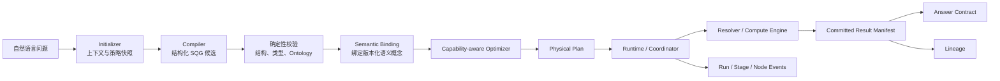

# Semantic Data Nexus

一个 **clean-room、open-source-first** 的语义自然语言分析平台基础项目。

用户最终可以用自然语言提问，例如“2026 年第二季度各区域利润是多少？”。系统不会把大模型生成的 SQL 直接交给数据库，而是先生成一个版本化、强类型的 **Semantic Query Graph（SQG）**，再经过确定性校验、语义绑定、能力感知优化和受控运行，最后交付带结果契约、执行记录与血缘的数据产品。

> 当前仓库不是一个完整产品，也不声称兼容任何专有平台。第一阶段只建立可审阅、可运行的语义契约核心和架构边界。

## 为什么这样做

自然语言转 SQL 很容易做出 Demo，却很难安全进入生产：模型可能编造字段、绕过权限、生成代价失控的查询，或在失败后无法解释发生了什么。Semantic Data Nexus 把“大模型建议”与“系统执行权”分开：

1. LLM 只能提出结构化 SQG 候选；
2. 确定性代码检查图结构、类型、Ontology 成员关系和版本；
3. Optimizer 只选择 Resolver 声明支持的能力；
4. Runtime 只执行经过验证的 Physical Plan；
5. Run / Stage / Node、Result Manifest 和 Lineage 全程可追踪。

## Clean-room 边界

本项目只依据公开资料、通用工程实践和独立设计实现可观察能力。

- 不复制专有源代码、Prompt、内部标识、凭据、URL、截图或私有数据；
- 不以反编译、流量截取或访问受限材料作为实现来源；
- 示例全部为合成数据，不映射真实企业、客户或人员；
- 外部项目的代码只有在许可证兼容、保留归属且经过明确依赖评审后才可引入；
- 贡献者必须遵循 [Clean-room checklist](docs/clean-room-checklist.md)。

详见 [ADR-0001](docs/adr/0001-clean-room-policy.md)。

## 当前状态

**P0：Architecture & Contract Foundation。**

已实现：

- `ontology/v0` 与 `sqg/v0` JSON Schema；
- SQG v0 的八个操作符：`SELECT`、`FILTER`、`AGGREGATE`、`PIVOT`、`DERIVE`、`PROJECT`、`SORT`、`JOIN`；
- Python 3.12 + Pydantic v2 强类型模型；
- 节点 ID、依赖顺序、输入数量、字段可用性、输出契约和 Ontology 精确成员关系的确定性校验；
- Run Event / State、Result Manifest / Answer / Lineage 的初始契约；
- 可运行 CLI、合成示例、自动化测试和 CI；
- 独立的确定性语义评估套件与安全合成数据；
- 独立的 Azure Bicep 部署基线（不改变 semantic-core 的本地可运行性）。

尚未实现：LLM 调用、SQL 生成与执行、Databricks 连接、Web UI、控制面 API 和持久化应用服务。Azure 基线当前只部署安全资源边界与占位工作负载，不代表上述应用能力已经实现。

## 快速开始

要求 Python 3.12。

```powershell
python -m venv .venv
.\.venv\Scripts\Activate.ps1
python -m pip install -e ".[dev]"
python -m pytest
python -m semantic_core validate examples\regional-quarter-profit.json --ontology examples\retail-ontology.json
```

成功时输出类似：

```text
VALID: examples\regional-quarter-profit.json (5 nodes, root=project_answer, contract=sqg/v0)
```

将操作符改成未知值、引用不存在/后置节点、声明错误输出，或把 `region` 写成大小写不同的 `Region`，CLI 会返回非零退出码和明确诊断。

安装后也可使用：

```powershell
sqg-validate validate examples\regional-quarter-profit.json --ontology examples\retail-ontology.json
```

## 端到端架构



任何路径都不存在“LLM SQL -> 数据库”的直连边。完整说明见：

- [架构总览](docs/architecture/overview.md)
- [模块与所有权边界](docs/architecture/modules.md)
- [Build vs Buy 决策矩阵](docs/architecture/build-vs-buy.md)
- [Azure 参考架构](docs/architecture/azure-reference.md)
- [术语表](docs/glossary.md)

## 仓库结构

```text
contracts/v0/                 语言无关、版本化 JSON Schema
packages/semantic-core/       当前唯一实现：SQG / Ontology 模型与校验
examples/                     无敏感信息的合成契约示例
tests/                        结构、语义和 Schema 测试
evals/                        确定性语义 golden evaluation 套件
data/synthetic/               可重复生成的安全合成数据
docs/architecture/            架构边界与技术选型
docs/adr/                     可追踪的架构决策
apps/                         未来 Vue 3 UX 边界（当前仅说明）
services/                     未来控制面/编译/运行服务边界（当前仅说明）
infra/                        Azure Bicep 安全部署基线与运维说明
```

## 路线图

P0–P5 从契约基础、单一 Databricks Resolver 垂直切片，逐步演进到多引擎、治理与企业控制面。第一条垂直切片仍然必须走 SQG、验证、Plan、Runtime、Result Manifest 和 Lineage 全链路。

阶段、退出标准、人员与风险详见 [docs/roadmap.md](docs/roadmap.md)。

## 参与贡献

请先阅读 [CONTRIBUTING.md](CONTRIBUTING.md)、[SECURITY.md](SECURITY.md) 和 [Clean-room checklist](docs/clean-room-checklist.md)。本项目采用 [Apache License 2.0](LICENSE)。
