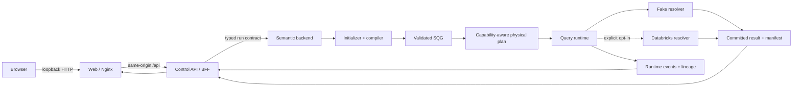

# Semantic Data Nexus

[](https://github.com/2012952877/semantic-data-nexus/actions/workflows/m0-release-gate.yml)

Semantic Data Nexus is a clean-room, open-source-first semantic analytics
vertical slice. It accepts a typed natural-language question, compiles a
versioned Semantic Query Graph (SQG), validates and plans it deterministically,
executes it through a bounded resolver boundary, and publishes a committed
result with manifest, diagnostics, and lineage.

## M0 status

**M0 is delivered as a reproducible local integration baseline.** The checked-in
stack includes the Vue Web workbench, Nginx edge, ASP.NET Core BFF, Python
semantic backend, deterministic initializer/compiler, capability-aware runtime,
fake and opt-in Databricks resolvers, evaluation suite, and Azure Bicep
baseline.

M0 is not a production deployment. Run metadata and inline results are
process-local, and the compiler supports two deterministic synthetic scenarios.
The broad Azure infrastructure baseline has static validation; a separate
[authenticated Consumption test](docs/operations/m0-azure-test.md) exercises
M0 over HTTPS without deploying that baseline.

## Delivered architecture



The initializer and compiler run in-process inside the semantic backend in the
M0 Compose topology. There is no direct browser-to-data-source edge and no
model-generated SQL execution path. See the
[M0 architecture and sequence](docs/architecture/m0-sequence.md).

## Governed flow

1. Web sends a bounded question and typed execution options to the BFF.
2. The BFF authenticates the caller, owns run metadata/idempotency, and forwards
   a stable run ID and trace context to the semantic backend.
3. The backend initializes semantic context, compiles a typed SQG, and proceeds
   only when deterministic schema, graph, ontology, and policy validation
   succeeds.
4. The runtime validates the physical plan, pushes down only resolver-declared
   capabilities, and executes unsupported operations locally.
5. The fake resolver reads checked-in synthetic CSVs by default. Live
   Databricks is a separate, explicit, read-only, parameterized opt-in.
6. Results become visible only after commit; detail responses include bounded
   rows, result manifest, stage/node diagnostics, and lineage. Cancellation is
   propagated across Web, BFF, backend, runtime, and an active provider request.

## Quick start: full M0 stack

Prerequisites are Docker Desktop or Docker Engine with Compose v2 and Python
3.12. From the repository root:

```shell
docker compose config --quiet
docker compose up --build --wait
python scripts/full_stack_smoke.py --base-url http://127.0.0.1:8080
```

Open <http://127.0.0.1:8080/ask>. Only this Web port is published, and it is
bound to loopback. The default resolver is deterministic `fake`; no credentials
or network data source are required.

Stop and remove the local stack:

```shell
docker compose down --volumes --remove-orphans
```

Operational details, browser smoke, recovery, and safe diagnostics are in the
[local Compose runbook](docs/operations/local-compose.md) and
[M0 operations, security, and cost runbook](docs/operations/m0-release.md).

## Web HTTP and mock modes

| Mode | Selection | Behavior |
| --- | --- | --- |
| Root Compose | Built with `VITE_NEXUS_CLIENT=http` | Uses the real same-origin Nginx -> BFF -> backend path |
| Local Web default | `VITE_NEXUS_CLIENT` unset or `mock` | Uses deterministic browser-only fixtures and local history |
| Local Web HTTP | `VITE_NEXUS_CLIENT=http` plus an approved loopback proxy | Uses the validated BFF HTTP adapter |

The HTTP client validates every successful BFF response before mapping it to the
UI. `VITE_*` values are embedded in browser assets and must never contain
credentials. See the [Web guide](apps/web/README.md) and
[HTTP client contract](docs/architecture/web-http-client.md).

## Live Databricks is opt-in

`compose.yaml` cannot enable live execution. Live mode requires both
`compose.databricks.yaml` and the `databricks` profile, plus host, warehouse,
and token values supplied only in the current shell. Missing values fail Compose
configuration before startup.

The connector accepts only a validated read-only query AST, parameterizes
literal values, enforces identifier/function allowlists, and bounds live output
to 1,000 rows, 10 MiB, and a 30-second statement timeout. Live tests are skipped
in CI and the default release gate. Follow the
[live opt-in procedure](docs/operations/local-compose.md#live-databricks-opt-in);
do not render or capture Compose configuration after setting live credentials.

## Security boundaries

- Root Compose publishes only `127.0.0.1`; backend networks remain internal.
- Local Nginx rejects unexpected Host and Origin values before injecting its
  fixed Development-only identity, limiting DNS-rebinding exposure.
- Containers run non-root with read-only root filesystems, dropped
  capabilities, and `no-new-privileges`.
- The BFF validates bounded request, status, detail, result, and diagnostic
  contracts. The backend and runtime fail closed at compile, validation,
  planning, resolver, cancellation, and commit boundaries.
- Secrets are not accepted in browser build variables or source-controlled
  configuration. Azure guidance prefers workload/managed identity and Key
  Vault.
- The repository-local clean-room scan inspects tracked content and reports only
  rule IDs and locations, never matching values.

## Tests and evaluation

The [M0 release workflow](.github/workflows/m0-release-gate.yml) fans into the
existing package workflows for:

- contract/schema tests and CLI validation;
- deterministic fixture regeneration and reference evaluation;
- Python tests, Ruff, mypy, and package builds where configured;
- actual compiler-to-runtime artifacts evaluated at 100 overall and 100 in
  semantic, plan, execution-result, governance, and observability dimensions
  for the two supported M0 cases;
- Web unit tests, typecheck, build, real HTTP-stub browser tests, and mock browser
  tests;
- .NET tests and publish;
- Bicep static build/regression assertions;
- Docker/Compose config, image build, health, identity-boundary smoke, real API
  smoke, deployed-browser smoke, diagnostics, and teardown;
- deterministic clean-room/private-demo scanning.

The 100-point threshold applies only to the supported regional-quarterly-profit
and monthly comparison cases; it is not a general semantic accuracy claim.

## Current limitations and non-goals

- The compiler is deterministic and scenario-bounded; M0 does not call an LLM.
- Supported integrated scenarios are regional quarterly profit and monthly
  `AGGREGATE -> PIVOT -> DERIVE -> PROJECT`.
- BFF state, backend state, and inline committed results are non-durable and
  process-local.
- HTTP mode has no BFF ontology or browser-component-health endpoint.
- Live Databricks is optional, CI-skipped, and requires operator-provided
  credentials and data grants.
- The Azure baseline is deployable IaC, but only static validation is evidenced
  here. Production networking, edge protection, durable storage adapters,
  restore evidence, and deployment smoke remain outside M0.
- M0 does not claim compatibility with any proprietary platform or private
  implementation.

## Repository map

```text
apps/web/                    Vue 3 workbench, mock and validated HTTP adapters
connectors/databricks/       Read-only Statement Execution resolver boundary
contracts/v0/                Versioned language-neutral JSON Schemas
data/synthetic/              Reproducible synthetic evaluation data
docs/                        Architecture, ADRs, runbooks, and release notes
evals/                       Deterministic golden evaluation package
infra/                       Azure Bicep baseline and static validation
packages/semantic-core/      Core SQG/Ontology models and validation
services/control-api/        Typed ASP.NET Core BFF
services/semantic-api/       Initializer, compiler, and SQG validation
services/query-runtime/      Physical planning, execution, commit, and lineage
services/semantic-backend/   M0 orchestration and integration adapters
scripts/                     Compose smoke and release audit utilities
```

## Release and operations references

- [M0 release notes](docs/releases/m0.md)
- [M0 architecture and sequence](docs/architecture/m0-sequence.md)
- [M0 operations, security, and cost runbook](docs/operations/m0-release.md)
- [Local Compose runbook](docs/operations/local-compose.md)
- [Azure deployment operations](docs/operations/azure-deployment.md)
- [Small authenticated Azure M0 test](docs/operations/m0-azure-test.md)
- [HTTP contracts](docs/architecture/http-contracts.md)
- [Clean-room checklist](docs/clean-room-checklist.md)
- [Roadmap](docs/roadmap.md)

Contributions must follow [CONTRIBUTING.md](CONTRIBUTING.md),
[SECURITY.md](SECURITY.md), and
[ADR-0001 clean-room policy](docs/adr/0001-clean-room-policy.md). The project is
licensed under [Apache License 2.0](LICENSE).
