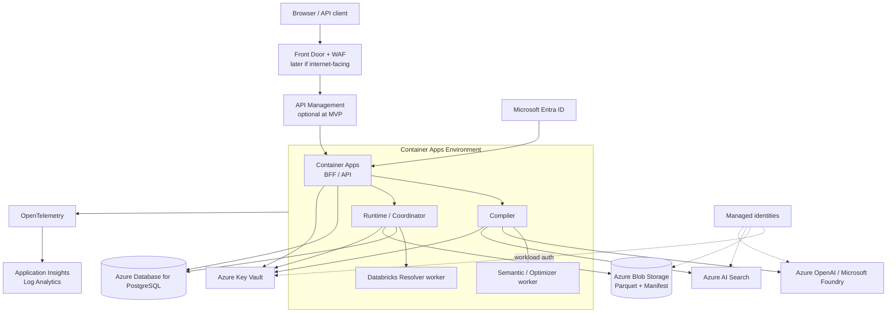

# Azure 参考架构（MVP）

本文定义保守、可演进的 Azure Well-Architected 目标拓扑。`infra/bicep`
现已提供可部署的 Container Apps 基线，但仓库只记录静态构建和回归断言，
没有已部署环境或部署后 smoke 证据。第一里程碑优先 Azure Container Apps，
而不是提前引入 AKS。

## 推荐拓扑

## MVP 选择

| 关注点 | Azure 选择 | 保守做法 | 本地等价 |
| --- | --- | --- | --- |
| 应用运行 | Azure Container Apps | 一个 Environment、少量按职责拆分的 App/Job；按并发和队列缩放；设置最小/最大副本和资源上限 | Docker Compose / 本地进程 |
| 身份 | Microsoft Entra ID + Managed Identity | 用户走 OIDC/OBO；服务访问 Azure 资源走用户分配或系统分配身份；不保存客户端密钥 | Keycloak + 开发身份 |
| 密钥 | Azure Key Vault | 应用配置只保存 secret URI/version；RBAC 最小权限；审计访问 | Vault Community 或开发 `.env`（仅假数据） |
| 控制数据库 | Azure Database for PostgreSQL Flexible Server | 存 Ontology/配置/Run 元数据；启用 HA 取决于 SLO；不存结果大对象 | PostgreSQL |
| 结果 | Azure Blob Storage | 独立容器保存临时分片与 committed manifest；生命周期规则清理临时/过期结果 | MinIO / 文件系统 |
| 检索 | Azure AI Search | 用于成员值和知识检索；每个索引记录租户/版本/字段作用域 | OpenSearch 或 Qdrant |
| LLM | Azure OpenAI / Microsoft Foundry | 结构化输出、模型部署白名单、内容与配额策略；Prompt/response 默认不进日志 | LiteLLM + 本地/托管模型适配器 |
| 可观测性 | OpenTelemetry + Application Insights / Log Analytics | 统一 trace context；Run ID 为关联字段；采样和敏感字段过滤 | OTel Collector + Jaeger/Prometheus/Loki |
| 消息 | 初期 PostgreSQL outbox/简单队列；需要解耦时 Service Bus | 命令/工作队列优先 Service Bus；高吞吐事件流才用 Event Hubs | RabbitMQ / Redpanda（按场景） |
| 边缘 | Front Door + WAF、APIM 按需求引入 | Internet-facing 和多区域时用 Front Door；API 产品治理/配额时用 APIM；内部 MVP 不必两者全上 | Caddy/NGINX + Kong（按需求） |

## 网络与安全

MVP 可以先采用受限公网端点以降低交付复杂度，但代码和资源边界必须 **private-network-ready**：

- Container Apps Environment 预留 VNet 集成方案和独立子网；
- PostgreSQL、Storage、Key Vault、AI Search、Azure OpenAI 预留 Private Endpoint 与 Private DNS Zone；
- 网络策略采用默认拒绝思路，应用仅出站到声明依赖；
- 使用 Managed Identity 和 RBAC，禁止在镜像、代码或普通配置中保存凭据；
- 用户权限在 BFF/Initializer 固化为请求快照；数据源自身权限仍是最终防线；
- OBO 只在确实需要下游保留用户身份时使用，后台任务使用受限工作负载身份；
- Container Registry 镜像固定 digest，CI 生成 SBOM 并扫描后再晋级（后续实现）。

## 可靠性与数据一致性

- 每个外部请求携带幂等键；Run 创建和事件追加保持事务一致；
- Runtime 对截止时间、取消、重试上限和退避做显式建模；
- 只有幂等且可证明安全的 Node 可自动重试；
- 结果先写临时路径，校验哈希与元数据后最后写 `committed=true` Manifest；
- Run Store 在 PostgreSQL，结果在 Blob；通过 Manifest 引用连接，不做跨存储分布式事务；
- 定期备份 PostgreSQL，并对 Blob 启用版本/软删除策略（取决于数据分类和成本）；
- 第一阶段单区域，不声称多区域容灾；RTO/RPO 明确后再设计主动/被动拓扑。

## 性能与成本

- Container Apps 设置资源和副本硬上限，Compiler 与 Runtime 分开扩缩；
- 大结果只写 Blob/Parquet，API 只返回预览和 Manifest 引用；
- Azure AI Search 和模型部署按真实负载选最小可用 SKU，开发环境定时缩减；
- 查询预算限制扫描量、行数、执行时间和并发；
- 通过 OTel 记录模型 token、Resolver 耗时、结果字节和失败类型，但不记录敏感正文；
- Service Bus、APIM、Front Door 仅在出现明确可靠性、治理或边缘需求时引入，避免“架构图驱动成本”。

## 运维与可观测性

所有 Python/.NET 服务采用 OpenTelemetry SDK，优先 OTLP 导出。建议最小信号：

- Trace：BFF 请求、Compiler、Validator、Optimizer、Run、Stage、Node、Resolver；
- Metric：成功率、各阶段时延、队列深度、重试、模型 token、扫描/输出字节；
- Log：结构化错误码、契约版本、部署版本和受控 ID；
- Alert：SLO burn rate、Run 堆积、结果提交失败、依赖限流和身份失败。

禁止在遥测中写入访问令牌、密钥、完整 Prompt、数据行、任意 SQL 或未经分类的用户问题。

## 部署边界

当前 Bicep 基线不会自行创建订阅或流水线凭据，也不证明任何资源已部署。
部署前必须替换占位镜像/命令，并单独评审命名、区域、SKU、网络、Private
DNS、RBAC、预算、诊断设置和销毁策略。先运行静态验证与 stack-aware
what-if，再用获批的 federated identity 部署开发环境并收集部署后证据。
详见 [`infra/README.md`](../../infra/README.md) 和
[`docs/operations/azure-deployment.md`](../operations/azure-deployment.md)。

## 官方参考

- [Azure Container Apps architecture best practices](https://learn.microsoft.com/azure/container-apps/architecture)
- [Managed identities in Azure Container Apps](https://learn.microsoft.com/azure/container-apps/managed-identity)
- [Azure OpenAI network and access configuration](https://learn.microsoft.com/azure/ai-foundry/openai/how-to/network)
- [Azure Well-Architected Framework](https://learn.microsoft.com/azure/well-architected/)
- [OpenTelemetry with Azure Monitor](https://learn.microsoft.com/azure/azure-monitor/app/opentelemetry-enable)
