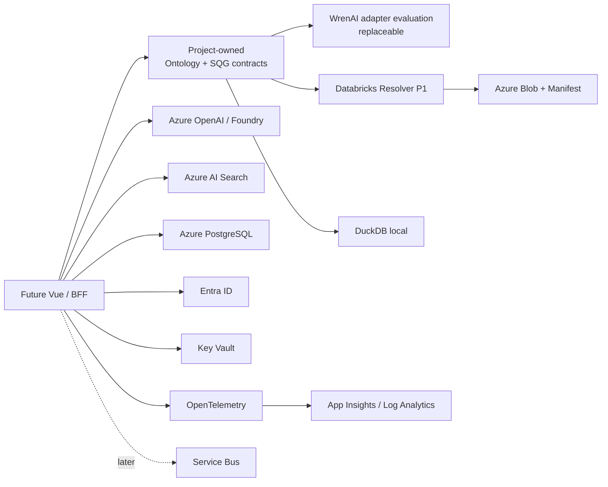

# Build vs Buy：开源组件与 Azure 托管替代

> 事实口径截至 2026-09-03。许可证和商业边界以项目主仓库、官方文档及 Microsoft Learn 为主；引入前仍需对锁定版本做法律与供应链复核。

## 决策原则

1. **先定义自己的版本化契约，再选择实现组件。** 任何第三方都不能绕过 SQG、语义绑定、策略、预算、Run/Result/Lineage 契约。
2. **WrenAI 是当前最接近“一体化 OSS 起点”的候选，但不是完整开源产品。** 它的 OSS engine 与商业 product layer 必须分开描述。
3. **Azure 没有对等的托管语义层。** Azure 服务适合替代模型、检索、身份、密钥、运行时、存储、消息和观测后端，不能替代 Ontology/SQG/Compiler。
4. **优先组合，而非寻找一个万能平台。** P1 只交付一个 Databricks Resolver；联邦引擎、企业目录和 durable workflow 在出现真实需求后引入。
5. **未知能力默认拒绝。** 接入组件必须通过 adapter 和 conformance test，不把组件内部对象直接暴露为平台契约。

集成工作量：**低**=标准 SDK/托管接入；**中**=需要认证、模型或数据源 adapter；**高**=需要控制面和治理流程；**很高**=相当于自建 planner/engine。

## 语义层与自然语言分析

| 候选 | 可替代哪个模块 | 不能替代 | 许可证 / 商业边界 | 集成成本 | 建议 |
| --- | --- | --- | --- | --- | --- |
| **WrenAI** | Semantic/context layer、governed NL-to-SQL runtime、CLI/MCP；是最接近单一 OSS 起点的候选 | 本项目 Typed SQG 契约与确定性守门、企业 IdP、密钥和观测后端；商业 UI/安全面不在 OSS 核内 | 多许可证映射：`core/`、`sdk/`、`skills/`、`examples/` 为 **Apache-2.0**；`docs/` 为 **CC BY 4.0**。商业层包含 RLS/CLS、user/group access、GenBI UI/dashboards/apps、advanced security/audit/support 等 | 中 | **首选参考/集成起点**。P1 评估通过 adapter 复用其 OSS 能力，但平台对外仍只认自己的 SQG/Plan/Run 契约；不能写成“所有企业能力均开源” |
| **Cube Core / Cube** | Headless semantic layer API，统一 metrics、dimensions、joins 等 | 完整 catalog、IdP、密钥、自然语言编译和完整 BI 产品 | **Cube Core Apache-2.0**；商业 Cube 增加 Analytics Chat、workbooks/dashboards、embedded surfaces、managed deployment、RBAC、多租户等 | 中 | **强备选**。若目标是更纯的 headless semantic API，比 WrenAI 更聚焦，但产品层需自建 |
| **MetricFlow** | dbt-first 指标定义和语义指标编译 | 通用产品级 semantic serving、交互 UI、catalog 和 Runtime | 当前 **Apache-2.0**；历史版本经历 AGPL/BSL。MetricFlow 可配合 dbt Core，通用 dbt Semantic Layer 服务属于 dbt 商业平台范围 | 中/高 | 已深度采用 dbt 时条件推荐；锁定并复核版本，不作为默认平台核心 |
| **Malloy** | 分析/建模语言，可作为语义作者体验参考 | 托管 semantic service、catalog、workflow、身份和运行状态 | **MIT**；未从上游主资料确认官方商业云边界 | 高 | 作为语言/建模研究对象，不作为 MVP 主干 |
| **Vanna 2.0** | 用户感知 NL-to-SQL、工具调用和流式 UI/Web 交互 | **通用 Typed SQG Compiler**、Ontology semantic layer 和 catalog | **MIT**；OSS 可自托管。付费层有 managed SaaS、on-prem Enterprise/Premium APIs，覆盖托管模型/存储、评测、观测、合规和扩缩等 | 中 | 可作为未来 Ask 交互层参考/组件；不作为唯一语义编译核心 |
| **DB-GPT** | Agentic SQL/code workflow、分析执行、skills/sandbox | 确定性 semantic compiler、governed semantic layer 和安全执行证明 | **MIT**；本次未从主仓库/文档确认清晰的官方 open-core 付费边界 | 中 | 适合实验性 agent workflow；进入受控执行路径前必须转换为平台契约 |

**选择：** 保持本仓库的 `semantic-core` 为权威契约/验证层；P1 首先用 WrenAI 做可替换的能力评估，因为它最接近单一 OSS 起点。若一体化能力的商业边界或内部模型不适合，退到 Cube Core（headless semantic layer）或独立 Compiler。Vanna/DB-GPT 不能成为执行授权边界。

## Metadata、Lineage 与计划标准

| 候选 | 可替代哪个模块 | 不能替代 | 许可证 / 商业边界 | 集成成本 | 建议 |
| --- | --- | --- | --- | --- | --- |
| **OpenMetadata** | Metadata catalog、context graph、governance、lineage | Typed Compiler、NL runtime、query engine | 仓库默认 **Apache-2.0**，允许包/文件级许可证差异；Collate 提供托管与部分 AI/企业能力 | 高 | P3 再评估；Azure AI Search 只能替代检索，不能替代 catalog/governance |
| **DataHub** | Metadata platform、catalog、governance、lineage | Compiler、query engine | Core **Apache-2.0**；DataHub Cloud 增加 AI automation、advanced governance、SLA、增强安全与支持 | 高 | P3 与 OpenMetadata 二选一评估，不在 P1 同时建设 |
| **OpenLineage** | Lineage 事件交换标准 | 内部 Lineage Contract、catalog、执行器 | **Apache-2.0**；标准本身无上游企业版 | 中 | **推荐作为未来导出协议**；内部仍保留更窄、版本化的 `lineage/vN` |
| **Substrait** | 跨语言/引擎 Physical Plan 交换 IR | Semantic layer、Optimizer 策略、query engine | **Apache-2.0** | 很高 | P4 多引擎互操作时评估；v0 不宣称兼容 |
| **Apache Calcite** | SQL parser/validator/optimizer framework | 存储、产品控制面、semantic layer | **Apache-2.0** | 很高 | 只有确定自研 JVM planner 时引入；MVP 不用 |

**选择：** 内部 Lineage/SQG 契约先保持小而稳定；OpenLineage 作为开放出口。OpenMetadata/DataHub、Substrait、Calcite 均推迟到对应规模问题真实出现。

## 查询执行与工作流

| 候选 | 可替代哪个模块 | 不能替代 | 许可证 / 商业边界 | 集成成本 | 建议 |
| --- | --- | --- | --- | --- | --- |
| **Trino** | 分布式/联邦 SQL 执行引擎 | Semantic layer、catalog、身份和 Runtime 状态机 | **Apache-2.0**；上游为 OSS 引擎，商业托管发行版另行评估 | 高 | P4 确认需要多源联邦后再选；不是 Databricks 单 Resolver MVP 的前置条件 |
| **DuckDB** | 嵌入式本地分析、fixture、轻量结果整形 | 多租户托管查询平台、身份、catalog | **MIT** | 低 | **P1 本地计算首选**；受内存、CPU、行数和超时预算约束 |
| **Apache DataFusion** | 可嵌入 Rust query engine 内核 | 完整产品面和控制面 | **Apache-2.0** | 很高 | 若后续明确建设 Rust 执行器再评估；当前用 DuckDB |
| **Temporal** | Durable execution、长流程状态、重试/补偿/人工等待 | Semantic layer、query engine、catalog | Server **MIT**；另有 Temporal Cloud | 中 | Run 跨小时/天、需要强恢复语义时推荐；P1 先用显式状态机，不提前引入 |
| **Dagster** | Asset-centric data orchestration/control plane | 面向用户的 NL runtime 和 semantic layer | Core **Apache-2.0**；Dagster+ 提供托管控制面、metadata stores、alerts、RBAC、audit、asset catalog 等 | 高 | 适合内部数据资产编排，不是交互式问答 MVP 首选 |
| **Azure Container Apps Jobs + Service Bus** | 简单异步 worker、触发、缩放和队列解耦 | 完整 durable workflow 语义、Semantic Runtime | 专有 Azure PaaS | 低/中 | Azure MVP 的简单编排选项；出现复杂补偿/长等待后再比较 Temporal |

**选择：** P1 数据源执行只有 Databricks Resolver，本地测试/小结果处理使用 DuckDB。Runtime 先实现明确、可持久化的 Run/Stage/Node 状态机；不为未来可能性提前部署 Trino、DataFusion、Temporal 或 Dagster。

## 身份、密钥与可观测性

| 候选 | 可替代哪个模块 | 不能替代 | 许可证 / 商业边界 | 集成成本 | 建议 |
| --- | --- | --- | --- | --- | --- |
| **OpenTelemetry** | Trace/Metric/Log instrumentation 和传输标准 | 观测数据存储、查询、告警后端 | **Apache-2.0** | 低 | **必选标准层**；不要把 Azure SDK 类型泄漏进领域代码 |
| **Application Insights / Log Analytics** | Azure APM、日志/Trace/Metric 后端 | OpenTelemetry 标准和业务 Run Store | 专有 Azure PaaS | 低 | Azure 默认观测后端，与 OTel 组合 |
| **Keycloak** | 自托管 IAM、SSO、federation、authorization | Semantic authorization、secret manager | **Apache-2.0**；另有 Red Hat build of Keycloak 商业支持发行版 | 中/高 | 本地/多云或强自托管身份时选；Azure-first 默认不自运维 |
| **Microsoft Entra ID** | 托管 IdP、SSO、OAuth/OIDC/OBO | 数据源 RLS/CLS 和 Ontology 权限模型 | 专有 SaaS；能力随许可层级变化 | 低 | **Azure 默认身份选项**；本地可用 Keycloak |
| **HashiCorp Vault** | Secret、key、certificate 管理与 broker | IdP、Semantic layer | Vault 1.15+ 为 **BUSL 1.1**，不是 OSI Open Source；限制竞争性 hosted/embedded offering；另有 Vault Enterprise/HCP Vault | 中 | **OSS-first 主干不推荐**；已有跨云 Vault 组织能力时单独法律评估 |
| **Azure Key Vault** | 托管 Secret/Key/Certificate 与 HSM 选项 | IdP、语义授权 | 专有 Azure PaaS | 低 | **Azure 默认密钥选项**；应用只存 secret reference，使用 Managed Identity |

**选择：** OpenTelemetry + Application Insights/Log Analytics；Entra ID + Managed Identity + Key Vault。Keycloak 是本地/多云替代。Vault 因 BUSL 边界不作为默认开源组件。

## Azure 托管平台矩阵

| Azure 服务 | 可替代哪个模块 | 不能替代 | 商业边界 | 集成成本 | 建议 |
| --- | --- | --- | --- | --- | --- |
| **Azure AI Search** | 成员值/文档检索、RAG index | Semantic layer、Ontology、catalog、Typed Compiler | 专有 PaaS；SKU/预览能力需部署时复核 | 中 | **成员值与知识检索首选**；本地用 OpenSearch/Qdrant |
| **Azure OpenAI / Microsoft Foundry** | 托管模型、模型部署/评测/治理接口 | 确定性 Compiler、SQG Validator、Runtime | 专有平台，模型和区域可用性/价格各异 | 低/中 | **LLM provider 首选**；只允许 structured output，模型无执行权 |
| **Azure Container Apps** | API、worker、job 容器运行和 KEDA 扩缩 | 应用逻辑、Semantic layer、Durable workflow 本身 | 专有 PaaS | 低/中 | **MVP 运行平台首选**；暂不使用 AKS |
| **Azure Database for PostgreSQL** | Control metadata、Ontology 版本、Run/Stage/Node 状态 | 大结果存储、联邦 query engine | 托管 PostgreSQL PaaS | 低 | **控制数据库首选**；本地 PostgreSQL |
| **Azure Blob Storage** | Parquet/JSON 分片、committed manifest、归档 | 控制数据库、catalog | 专有 PaaS | 低 | **结果存储首选**；本地 filesystem/MinIO |
| **Azure Service Bus** | 命令/工作队列、可靠消息、topic/subscription | Workflow DSL、事件分析平台 | 专有 PaaS | 低/中 | 出现异步解耦需求时首选；P0 不部署 |
| **Azure Event Hubs** | 高吞吐事件/遥测/lineage stream | 命令队列、Durable workflow | 专有 PaaS | 中 | 只有吞吐规模证明需要时引入；Run 命令优先 Service Bus |
| **Azure Front Door** | 全球 L7 入口、WAF、CDN、跨区域路由 | API 生命周期、身份和应用授权 | 专有 PaaS | 中 | Internet-facing、多区域或 WAF 需求明确时引入 |
| **Azure API Management** | API gateway、策略、配额、版本和开发者门户 | 应用业务逻辑、IdP | 专有 PaaS | 中 | 对外 API 产品化时引入；内部 MVP 可先不部署 |

## 推荐组合与阶段结论

### P0/P1 推荐

- **权威核心：** 本项目版本化 Ontology/SQG/Run/Result/Lineage 契约；
- **最接近单一 OSS 起点：** WrenAI，以 adapter/实验方式评估，不继承其商业 product layer，也不让其内部 IR 成为公共契约；
- **第一执行链：** 一个 Databricks Resolver；本地 DuckDB；
- **Azure：** Container Apps、Entra ID/Managed Identity、Key Vault、PostgreSQL、Blob、AI Search、Azure OpenAI/Foundry、OpenTelemetry -> Application Insights/Log Analytics；
- **按需引入：** Service Bus；只有高吞吐事件流才选 Event Hubs；只有外部入口/治理需求才选 Front Door/APIM。

### 明确推迟

- OpenMetadata/DataHub：P3 治理规模出现后；
- Trino/Substrait/DataFusion/Calcite：P4 多引擎或自研 Planner 需要出现后；
- Temporal/Dagster：运行时恢复或资产编排复杂度证明需要后；
- Vault：不是默认 OSS 选择，Azure-first 使用 Key Vault。

## 主要来源

- WrenAI：[README](https://github.com/Canner/WrenAI/blob/main/README.md)、[LICENSE](https://github.com/Canner/WrenAI/blob/main/LICENSE)、[Open Core](https://getwren.ai/open-core)
- Vanna：[README](https://github.com/vanna-ai/vanna/blob/main/README.md)、[LICENSE](https://github.com/vanna-ai/vanna/blob/main/LICENSE.txt)、[Build vs Buy](https://vanna.ai/premium)
- DB-GPT：[README](https://github.com/eosphoros-ai/DB-GPT/blob/main/README.md)、[LICENSE](https://github.com/eosphoros-ai/DB-GPT/blob/main/LICENSE)
- MetricFlow：[README/Licensing history](https://github.com/dbt-labs/metricflow/blob/main/README.md)、[dbt docs](https://docs.getdbt.com/docs/build/metricflow-commands)
- Cube：[Cube Core README](https://github.com/cube-js/cube/blob/master/README.md)、[Cube docs](https://docs.cube.dev/docs/introduction)
- Malloy：[Documentation](https://docs.malloydata.dev/documentation/)、[LICENSE](https://github.com/malloydata/malloy/blob/main/LICENSE)
- OpenMetadata：[Repository](https://github.com/open-metadata/OpenMetadata)、[Collate comparison](https://www.getcollate.io/comparison)
- DataHub：[Repository](https://github.com/datahub-project/datahub)、[Cloud vs Core](https://datahub.com/products/cloud-vs-core/)
- OpenLineage：[Documentation](https://openlineage.io/docs/)、Substrait：[Specification](https://substrait.io/)、Calcite：[Project](https://calcite.apache.org/)
- Trino：[Documentation](https://trino.io/docs/current/overview/concepts.html)、DuckDB：[Project](https://duckdb.org/)、DataFusion：[Project](https://datafusion.apache.org/)
- Temporal：[Documentation](https://docs.temporal.io/)、Dagster：[Dagster+ boundary](https://docs.dagster.io/deployment/dagster-plus)
- OpenTelemetry：[Documentation](https://opentelemetry.io/docs/)、Keycloak：[Project](https://www.keycloak.org/)、Vault：[LICENSE](https://github.com/hashicorp/vault/blob/main/LICENSE)
- Azure：[Container Apps](https://learn.microsoft.com/azure/container-apps/overview)、[AI Search](https://learn.microsoft.com/azure/search/search-what-is-azure-search)、[Foundry](https://learn.microsoft.com/azure/foundry/what-is-foundry)、[PostgreSQL](https://learn.microsoft.com/azure/postgresql/overview)、[Blob](https://learn.microsoft.com/azure/storage/blobs/storage-blobs-overview)、[Service Bus](https://learn.microsoft.com/azure/service-bus-messaging/service-bus-messaging-overview)、[Event Hubs](https://learn.microsoft.com/azure/event-hubs/event-hubs-about)、[Application Insights](https://learn.microsoft.com/azure/azure-monitor/app/app-insights-overview)、[Entra](https://learn.microsoft.com/entra/fundamentals/what-is-entra)、[Key Vault](https://learn.microsoft.com/azure/key-vault/general/overview)、[Front Door](https://learn.microsoft.com/azure/frontdoor/front-door-overview)、[API Management](https://learn.microsoft.com/azure/api-management/api-management-key-concepts)

