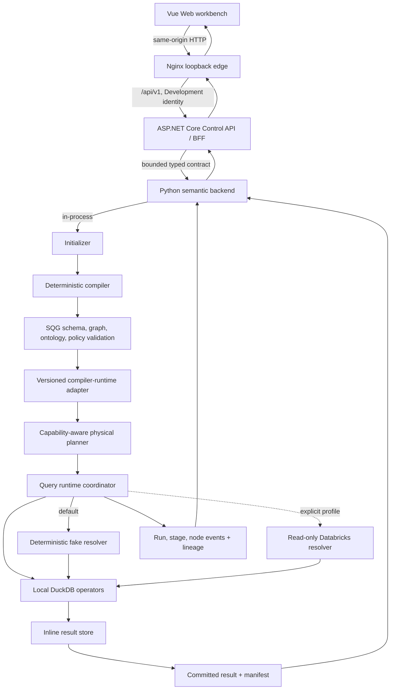
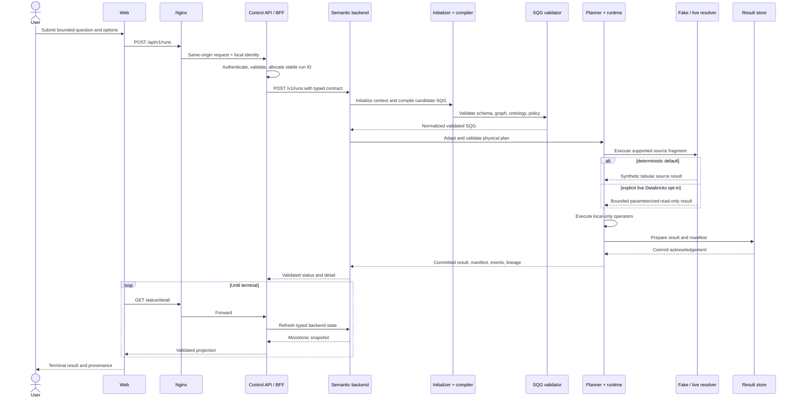
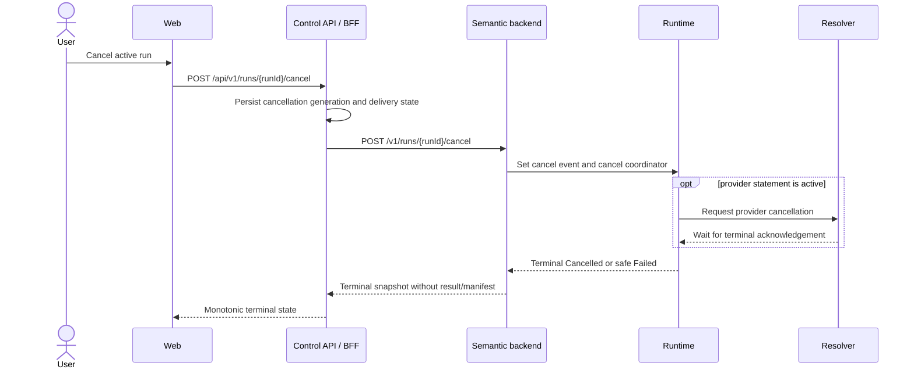

# M0 architecture and governed sequence

## Scope

This document describes the delivered M0 local path. It is intentionally
narrower than the future Azure reference architecture: the semantic backend
hosts the initializer/compiler in-process, the fake resolver is the default,
state is process-local, and live Databricks requires explicit operator opt-in.

## Component boundaries

Only the Web/Nginx port is published by root Compose. The Control API and
semantic backend are reachable only on Compose networks. The compiler never
executes SQL and the runtime never accepts a natural-language question.

## Successful run sequence

The BFF uses `StartPending` and retryable `DispatchUnknown` states to avoid
turning ambiguous transport loss into a false terminal failure. A result is
published only when the result store has committed its manifest. Failed or
cancelled runs do not synthesize a successful manifest.

## Cancellation sequence

Cancellation is a request until terminal acknowledgement. The live adapter does
not report `Cancelled` merely because a provider cancel request was accepted; an
unconfirmed provider outcome becomes a safe failure. A late cancel cannot
overwrite an already committed `Succeeded` result.

## Validation and error boundaries

| Boundary | Enforced behavior | Observable outcome |
| --- | --- | --- |
| Web -> BFF | Request/response shape, identifier, enum, scalar, timestamp, and size validation | Unsafe or malformed payload is rejected before UI state is trusted |
| Nginx local edge | Loopback publication, Host/Origin allowlists, 64 KiB request body, fixed Development identity | Unexpected Host returns 421; non-local Origin returns 403 |
| BFF dispatch | Authentication, authorization, idempotency, per-run coordination, bounded backend timeout | Definitive rejection fails; ambiguous delivery remains `DispatchUnknown` and reconcilable |
| Compiler/SQG | Versioned schema, node order/arity, field flow, ontology membership, policy, and mode topology | Compile/validation diagnostics; runtime is not invoked |
| Adapter/planner | Only a successful normalized SQG is adapted; physical plan and resolver capabilities are validated | Invalid or unsupported plans fail before source execution |
| Resolver | Fake source is deterministic; live SQL is single-query, read-only, parameterized, allowlisted, and bounded | Stable safe diagnostic; no provider payload, SQL, host, rows, or credential text is logged |
| Runtime/local operators | Deadlines, memory/row bounds, cancellation events, and node/stage state transitions | Terminal `Failed`, `TimedOut`, or `Cancelled`; no success-shaped fallback |
| Result commit | Result schema/rows and manifest are validated before atomic in-memory commit | Detail is published only with a committed result identity and checksum |
| BFF detail | Cross-language result, manifest, lineage, and diagnostic limits are revalidated | Invalid backend success payload is rejected rather than persisted |

## Data and trust constraints

- Questions and typed options cross the Web/BFF boundary; credentials do not.
- The BFF owns identity and control-plane metadata but does not compile or
  execute a query.
- The semantic backend owns orchestration and integration adapters but does not
  expose provider credentials or raw provider errors.
- `PIVOT`, `DERIVE`, and `PROJECT` remain local-only in M0. The planner pushes
  down only resolver-declared operations.
- The fake source reads only checked-in synthetic CSVs. Live Databricks uses a
  separate Compose network and is absent from default CI execution.
- Lineage connects logical, physical, source, and committed-result nodes using
  `realized_as`, `reads_from`, `depends_on`, and `produces` relations.

## Related documents

- [HTTP contracts](http-contracts.md)
- [Web HTTP client](web-http-client.md)
- [Local Compose runbook](../operations/local-compose.md)
- [M0 operations, security, and cost runbook](../operations/m0-release.md)
- [M0 release notes](../releases/m0.md)
