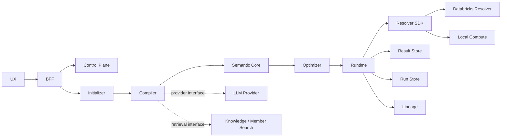

# 模块、契约与所有权边界

模块化的目的不是提前拆成大量微服务，而是让每类决策只有一个明确所有者。MVP 默认采用模块化单体或少量服务；只有独立扩缩、故障隔离或权限边界成立时才拆部署单元。

| 模块 | 单一职责 | 输入 / 输出契约 | 依赖边界 | M0 | 后续 |
| --- | --- | --- | --- | --- | --- |
| **Web UX** | Ask、运行时间线和基础管理 UI | HTTP API；不直接读取数据库 | 只依赖 BFF | Vue 3 + TypeScript，含 mock/http adapter | SSE 与管理能力 |
| **BFF / API** | 身份、运行元数据、API 聚合、幂等请求 | Question Request、Run State、typed detail | 调 semantic backend；不执行查询 | ASP.NET Core，进程内存储 | 持久化控制面 |
| **Control Plane** | 发布 Ontology、Resolver、凭据引用、模型和策略版本 | Ontology、Capability、Policy 等版本化资源 | PostgreSQL、Key Vault 引用；不持有数据结果 | 仅静态契约与 BFF run control | 管理 API、审批、审计 |
| **Initializer** | 冻结一次请求的配置与授权快照 | Question + identity -> RequestContext | 读版本化语义资源，不访问业务数据 | 确定性 initializer | 缓存、区域与预算选择 |
| **Compiler** | 自然语言意图生成 SQG 候选 | RequestContext -> `sqg/vN` 或诊断 | 无执行凭据 | 两种确定性合成模式，无 LLM | 多轮澄清、Prompt/模型版本 |
| **Semantic Core** | 契约模型、结构校验、语义绑定 | Ontology + SQG -> Bound SQG / diagnostics | 纯函数优先，无网络依赖 | 已实现 | 类型推导、策略规则 |
| **Optimizer** | Logical Plan 到 Physical Plan | Bound SQG + capabilities -> plans | 只读 Resolver capabilities | 能力感知 planner | 成本模型、多引擎拆分 |
| **Runtime / Coordinator** | 调度、状态机、取消、结果提交 | Physical Plan -> Run Events / Manifest | Resolver、Result Store、Run Store | 进程内 coordinator | Durable workflow |
| **Resolver SDK** | 统一数据源适配器协议 | Capability、Plan Fragment、typed rows/errors | 不依赖 Compiler；凭据在边缘解析 | Runtime protocol 与 fake resolver | conformance test kit |
| **Databricks Resolver** | 首个实时数据源边界 | Plan Fragment -> Databricks operation | Databricks Statement Execution API | 显式 opt-in、CI skipped | 成本/统计、增量能力 |
| **Local Compute** | 小结果整形和本地执行 | Plan Fragment / Arrow -> result parts | DuckDB，受资源预算约束 | 已实现 | DataFusion 评估 |
| **Member Resolver** | 规范化业务成员值 | query + field scope -> candidates | Azure AI Search / local alternative | P2 | 混合检索、反馈学习 |
| **Result Store** | Manifest、保留和读取 | Result Manifest / Answer | 不保存控制配置 | 有界进程内 committed result | Blob/Parquet、签名 URL、清理 |
| **Run Store** | Run / Stage / Node 与事件序列 | Run Event -> Run State | 单调 sequence | BFF/backend 进程内实现 | PostgreSQL、SSE projection、统计 |
| **Lineage** | 记录和导出语义/执行血缘 | Lineage Contract | 可导出 OpenLineage / metadata catalog | logical/physical/source/result lineage | 字段级血缘图 |
| **Observability** | Trace、Metric、Log 和告警 | OpenTelemetry signals | 后端可替换；禁止记录敏感正文 | 文档边界 | SLO、成本与质量面板 |
| **Identity & Secrets** | 用户/工作负载身份、凭据最小权限 | OAuth/OIDC/OBO、secret reference | Entra/Keycloak、Key Vault/Vault | 文档边界 | 条件访问、轮换 |

## API 与依赖规则

依赖必须从编排层指向稳定契约，禁止反向引用：

- `semantic-core` 不依赖 LLM、数据库、Web 框架或 Azure SDK；
- Compiler 不依赖具体 Resolver，也拿不到执行凭据；
- Resolver 不解析自然语言，不接受未版本化 dict 或任意 SQL 字符串；
- BFF 不包含 Optimizer 或数据源逻辑；
- Result Store 与 Run Store 分离，避免大结果进入控制数据库；
- Azure SDK 只能出现在适配器/基础设施边缘，领域模型保持云无关。

## 仓库所有权建议

| 路径 | 所有者 | 变更要求 |
| --- | --- | --- |
| `contracts/` | Architecture + Semantic | 兼容性说明、Schema 测试、版本决策 |
| `packages/semantic-core/` | Semantic | 确定性、无 I/O、类型与负例测试 |
| `services/semantic-api/` | Applied AI / Semantic | 确定性编译、版本化语义资源、无执行权 |
| `services/query-runtime/` | Platform | 状态机、计划、取消、预算、提交和血缘 |
| `connectors/databricks/` | Data Connectors | Capability 声明、只读验证、最小权限 |
| `services/semantic-backend/` | Platform / Semantic | 编译到运行时适配、编排与有界详情 |
| `services/control-api/` | API / Identity | BFF 契约、鉴权、幂等和控制元数据 |
| `apps/web/` | Product UX | API 契约、可访问性、无密钥 |
| `infra/` | Platform / Security | 环境参数、What-if、静态验证与安全边界 |

## MVP 与非 MVP

MVP 是“一条窄但真实的纵向链路”：一个合成/测试 Ontology、一个 Databricks Resolver、SQG 编译与验证、单引擎 Plan、Runtime 状态、Blob/本地结果 Manifest 和 Lineage。多数据源联邦、自动 Ontology 生成、可视化低代码编排、复杂成本优化和企业级管理 UI 均推迟到明确阶段。
