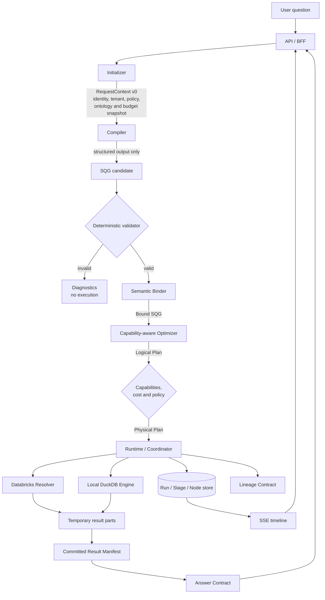
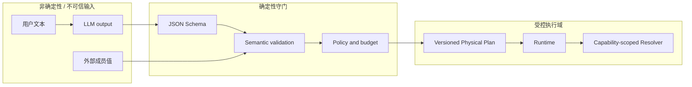

# 架构总览

## 目标与约束

Semantic Data Nexus 把自然语言分析实现为一个受治理的编译与运行系统，而不是聊天机器人直接拼 SQL。

核心不变量：

1. LLM 输出永远不是可执行权限；
2. 每个跨模块对象都有明确 Schema 与版本；
3. 名称必须绑定到精确 Ontology 版本；
4. Optimizer 只能使用执行器声明的能力；
5. Runtime 只接受验证后的 Physical Plan；
6. 结果只有在 Manifest 原子提交后才可见；
7. Run / Stage / Node 状态和 Lineage 可持久化、可重放、可关联。

## 端到端流程

### 1. Initializer

创建不可变 `RequestContext`：请求 ID、租户与用户、授权范围、Ontology 版本、可用 Resolver、模型配置版本、区域、预算和功能开关。它不访问业务数据，也不生成查询。

### 2. Compiler

结合问题和受控语义上下文生成 `sqg/v0` 候选。LLM 必须使用结构化输出；自由文本只能作为解释，不能进入执行路径。编译失败返回诊断，不自动降级成 SQL。

### 3. Deterministic Validator 与 Semantic Binder

Validator 检查 Schema、操作符、参数类型、唯一 ID、依赖顺序、输入数量、字段传播和输出声明。Binder 再检查 Entity、Field、Metric、Relation 是否精确存在于指定 Ontology 版本。当前 `semantic-core` 实现了这两个边界的首版。

### 4. Optimizer

先形成引擎无关 Logical Plan，再根据 Resolver Capability、数据位置、预算、策略和预估成本形成 Physical Plan。任何 Pushdown 都需要声明语义等价；未知能力默认不支持。

### 5. Runtime / Coordinator

Runtime 持久化 Run，拆成 Stage / Node，按计划调用 Resolver，传播取消与截止时间，并对有限的幂等步骤重试。Runtime 不接收自然语言，也不重新解释业务语义。

### 6. Result 与 Lineage

执行器写入临时分片；Coordinator 校验分片后最后写入不可变 Manifest。Answer 引用已提交 Manifest，Lineage 连接源语义概念、SQG 节点和结果。失败运行不得暴露半成品结果。

## 信任边界

LLM、用户输入和外部值永远位于守门边界之外。凭据只在 Runtime / Resolver 的最小权限范围内解析；Compiler 看不到数据源密钥。

## M0 已交付范围

M0 在 v0 契约基础上交付了两条确定性合成场景的可执行纵向链路：
Vue Web、Nginx、本地开发身份边界、ASP.NET Core BFF、Initializer、
Compiler、SQG 验证、能力感知 Physical Planner、Runtime、DuckDB 本地算子、
默认 fake Resolver、显式 opt-in 的 Databricks Resolver，以及 committed
result、manifest、diagnostics 和 lineage。根目录 Compose 是当前可复现的
集成拓扑，详见 [M0 sequence](m0-sequence.md)。

M0 不包含 LLM 调用、任意问题编译、持久化 Run/Result Store、已验证的 Azure
部署或生产网络边界。Azure Bicep 仅有静态构建与回归断言证据。
