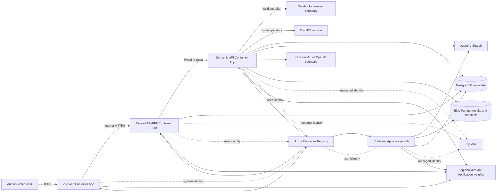

# Azure deployment operations

## Architecture

Only the web placeholder has external ingress. Control and semantic APIs use environment-internal ingress. APIM or Front Door with WAF is a later-stage edge boundary, not a dependency of the low-cost baseline.

## Managed identity flow

- The web app uses a system-assigned identity.
- Control API, semantic API, and worker use separate user-assigned identities to keep permissions stable across revisions and jobs.
- All workloads receive `AcrPull` scoped to the registry.
- Semantic API and worker receive `Storage Blob Data Contributor` scoped to the result storage account.
- Control API, semantic API, and worker receive `Key Vault Secrets User` scoped to the vault.
- Semantic API receives `Search Index Data Reader`; worker receives `Search Index Data Contributor`.
- When the optional Azure OpenAI account is enabled, only the semantic API receives `Cognitive Services OpenAI User`.

Application code should use the Azure Identity default credential chain locally and managed identity in Azure. Do not copy access tokens, principal identifiers, keys, or connection strings into environment variables, deployment outputs, logs, or source files.

PostgreSQL password authentication is disabled. Enable the Entra administrator during deployment using values supplied from the operator's secure session, then use managed-identity tokens for workload database roles. Database grants remain an explicit bootstrap operation and should be audited.

## Secret rotation

Prefer identity-based access so there is no application secret to rotate. For third-party systems or services that cannot use managed identity:

1. Store the value as a versioned Key Vault secret.
2. Grant only `Key Vault Secrets User` to the workload that needs it.
3. Reference the Key Vault secret from Container Apps by managed identity; never place the value in Bicep parameters.
4. Add the new version, restart or revise the consumer, verify health, and only then disable the old version.
5. Alert on secret expiry and denied vault access.

Do not emit secret URIs containing sensitive query strings or secret values. A Key Vault URI without a secret value is configuration, but it should still be treated as environment metadata.

## Networking hardening

Development and the deployable production example use authenticated public endpoints because this baseline does not create private network paths. Never disable public data-plane access before adding:

- A Container Apps infrastructure subnet and an internal environment where feasible.
- Private endpoints and private DNS zones for Blob, Key Vault, PostgreSQL, Search, ACR, Azure OpenAI, Azure Monitor, and Application Insights.
- Explicit egress through a firewall or NAT path with DNS and destination policy.
- Front Door with WAF or APIM for public ingress, rate limiting, TLS policy, and centralized authorization.
- Network Security Groups with narrowly scoped flows between subnets.

Private endpoint support for ACR requires Premium. Validate regional feature availability and DNS resolution from Container Apps before disabling public access.

## Scaling and reliability

- Development APIs scale to zero. Production keeps at least one replica; use two or more replicas across availability zones when the service and region support it.
- Tune HTTP concurrency using measured latency and CPU/memory saturation, not request count alone.
- Keep the worker idempotent. Use run identifiers, deterministic result paths, and conditional writes so retries cannot corrupt manifests.
- Set explicit job timeout, retry limits, and dead-letter behavior in the application workflow.
- PostgreSQL production defaults to zone-redundant high availability. Confirm the selected region supports the requested zone topology.
- Use immutable image tags or digests and retain the prior healthy Container Apps revision for rollback.

## Backups and disaster recovery

- PostgreSQL automated backup retention is 7 days in development and 35 days in production. Geo-redundant backup is intentionally not enabled by this baseline; decide based on regional recovery objectives.
- Blob versioning, change feed, and soft delete protect accidental changes but are not a cross-region backup. Add object replication or GRS/GZRS where the recovery point objective requires it.
- Search indexes should be reproducible from governed metadata and source artifacts. Treat the index as rebuildable unless business requirements demand a separate export strategy.
- Infrastructure is idempotent Bicep, but data recovery remains a separate runbook.
- Record target RTO/RPO, paired-region choice, restore ownership, and quarterly restore-test evidence before production launch.

## Observability and OpenTelemetry

Diagnostic settings route resource logs to Log Analytics. Application Insights is workspace based and local authentication is disabled. Instrument workloads with OpenTelemetry:

- Propagate W3C trace context from web to control API, semantic API, worker, resolver calls, and storage writes.
- Add low-cardinality attributes for environment, service, deployment revision, run ID, and plan stage.
- Never record prompts, natural-language questions, generated queries, credentials, tokens, result rows, private hostnames, or customer identifiers in spans or logs.
- Use sampling and redaction at the SDK boundary; default to metadata-only traces.
- Correlate lineage and run events through synthetic run IDs rather than user identifiers.
- Alert on failed revisions, job failure rate, PostgreSQL saturation, throttling, storage errors, search latency, denied RBAC operations, and telemetry ingestion cap.

The template does not inject an Application Insights connection string into containers. Add an approved identity-aware telemetry configuration with application code rather than treating a connection string as a secretless shortcut.

## Cost guardrails

Track these categories separately:

| Category | Primary driver | Guardrail |
| --- | --- | --- |
| Container Apps | vCPU/GiB seconds and minimum replicas | Scale development to zero; cap replicas |
| PostgreSQL | Compute tier, storage, backups, HA | Burstable development SKU; scheduled shutdown/recreate where acceptable |
| Search | SKU, replicas, partitions | One Basic unit in development; scale only from measured load |
| Log Analytics | Ingestion and retention | Daily cap, sampling, metadata-only logs |
| Storage | Capacity, operations, replication, egress | Lifecycle policy after retention requirements are defined |
| ACR | SKU and storage | Basic development SKU; clean unreferenced images |
| Azure OpenAI | Tokens and model deployments | Disabled by default; quotas, budgets, and per-workload usage limits |
| Private networking/edge | Endpoints, DNS, firewall, APIM, Front Door | Enable for production threat model; avoid unused development instances |

Create budgets and anomaly alerts per environment and require `environment`, `workload`, `owner`, and `costCenter` tags. Exact prices vary by region, agreement, and date; obtain them from the Azure pricing calculator before approval.

## Change procedure

1. Build the Bicep and parameter files locally.
2. Run resource-group what-if and review deletes, replacements, RBAC changes, network exposure, and SKU changes.
3. Deploy development first and run identity, ingress, diagnostics, and restore smoke tests.
4. Promote the same template with production parameters through an approved federated deployment identity.
5. Store no Azure credentials in GitHub. Use OpenID Connect workload federation if deployment CI is added later.
